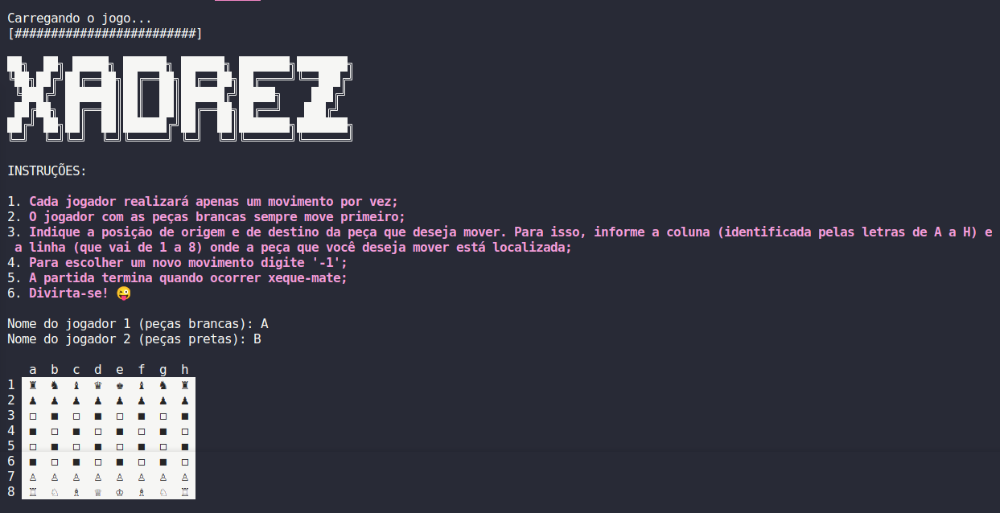

<h1 align="center"> Jogo de Xadrez </h1>

  <a href="#-projeto">Projeto</a>&nbsp;&nbsp;&nbsp;|&nbsp;&nbsp;&nbsp;
  <a href="#-tecnologias">Tecnologias</a>

  

## 💻 Projeto

O presente trabalho consiste na criação de um Jogo de Xadrez de terminal, elaborado como projeto de conclusão da disciplina de Laboratório de Algoritmos e Programação

## 🚀 Tecnologias

Esse projeto foi desenvolvido com as seguintes tecnologias:

- Python

---

by mayarans and thiagotrajanodev
